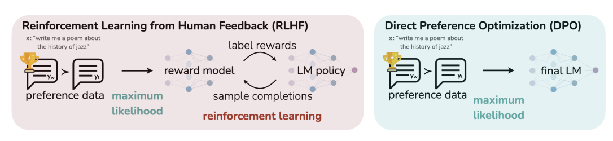

# Overview
We will generate a preference dataset using PairRM and fine-tune a model with [DPO (Direct Preference Optimization)](https://arxiv.org/abs/2305.18290). 
This powerful training recipe is the foundation for some of the top models according to Alpaca Eval.

# Steps
1. Generate a Preference Dataset
Notebook: 
* Extract Instructions from Lima Dataset:
* For each instruction, use mistralai/Mistral-7B-Instruct-v0.2 to generate 5 responses using the appropriate chat template for mistralai/Mistral-7B-Instruct-v0.2.
* Use PairRM to create a preference dataset from the generated responses.

2. Fine-Tune the Model with DPO
Notebook: 
* Use DPO to fine-tune mistralai/Mistral-7B-Instruct-v0.2 on the preference dataset.
* use lora peft adapters for efficient fine-tuning 

3. Implement of Iterative DPO [Self-Rewarding Language Models](https://arxiv.org/abs/2305.18290):
Notebook: 
* This approach combines the idea of LLM-as-a-Judge with DPO trained iteratively.
