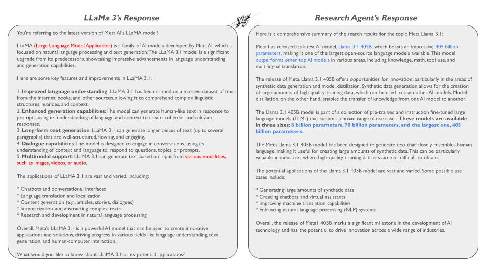

# LLM Research Agent

## Overview
The LLM Research Agent is a powerful tool designed to streamline the research process by leveraging advanced language model functionalities. It breaks down broad research topics, expands queries, retrieves relevant information using the Brave Search API, summarizes the results, and provides critical feedback to refine your research.



## Features
### 1. Topic Breakdown Tool
The Topic Breakdown Tool takes a broad research topic and deconstructs it into smaller, more focused subtopics or subqueries. This helps to narrow down the scope of research, making it easier to target specific areas of interest.

### 2. Query Expansion Tool
The Query Expansion Tool enhances the subqueries generated by the Topic Breakdown Tool. It generates related keywords, synonyms, and phrases to broaden the scope of the search, ensuring that no relevant information is missed.

### 3. Search Tool
The Search Tool is a wrapper around the Brave Search API, enabling the agent to retrieve relevant data efficiently. Note that the free tier of the Brave Search API allows for 1000 queries per month. To comply with API restrictions, a one-second delay is added between queries.

### 4. Search Summary Tool
The Search Summary Tool synthesizes the information gathered from the search results. It generates a comprehensive summary that incorporates key findings and insights from the retrieved data.

### 5. Critique Tool
The Critique Tool provides critical analysis of the generated summary. It offers suggestions for improvement and may suggest additional relevant topics to explore, ensuring the research is thorough and well-rounded.

## Installation
* Clone the repository:
```
git clone https://github.com/chakraborty-arnab/research-agent.git
cd llm-research-agent
```

* Install dependencies:
```
pip install -r requirements.txt
```

* Set up the [Brave Search](https://brave.com/search/api/) API key:
```
export BRAVE_API_KEY='your_api_key'
```
